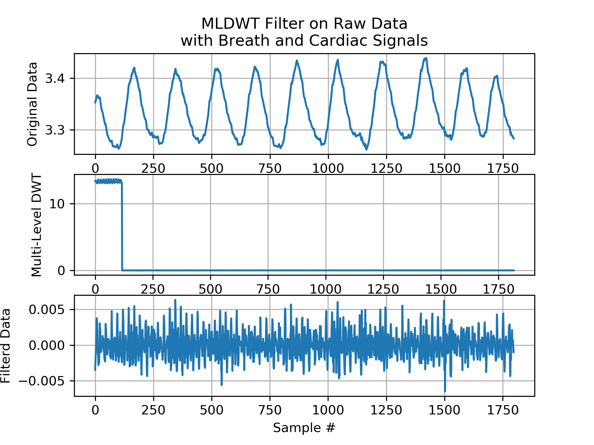

## Multi-Level Wavelet Transformation Filter
Use a MLDWT to filter out the breath rate (BR) from the cardiac signal within some impedance data.

2/27/19
by: gunnarpope for Saaid 

## To run:

    $ python wavelet_filters.py

